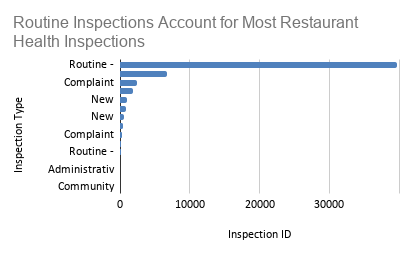
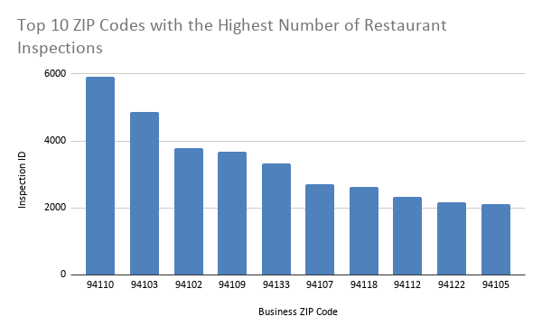
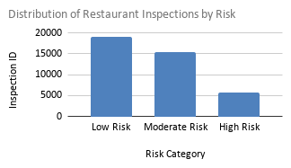

# Some San Francisco Neighborhoods Consistently Receive More Restaurant Health Violations Than Others
### Where the Dataset came from: [Link](https://data.sfgov.org/Health-and-Social-Services/Health-Inspection-Scores-2016-2019-/pyih-qa8i/data_preview)  
The San Francisco Department of Public Health (SFDPH) conducts routine health inspections for any food establishments located in San Francisco. The inspections are conducted to ensure that these establishments are complying with California food safety regulations and to also protect public health. The dataset shows that it’s a trustworthy source because the data collected is maintained by a government agency who are responsible for it. Inspectors have to follow standardized procedures when inspecting so it makes the data consistent with the information that’s being gathered through surveys and self-reports. Establishments are not all inspected with the same frequency so some businesses might appear in the dataset more often than others. Larger establishments with previous violations might also get additional inspections which would also increase the total number of recorded violations. Inspection records only capture conditions at the time of the inspection so it won’t reflect the establishments’ cleanliness on a day-to-day basis or their food quality. We might also see some reporting delays or updates which may cause the dataset to be inaccurate at the time of viewing. 

### Data Analysis: [Link](https://docs.google.com/spreadsheets/d/13W1oCbMFhBDqglMESXc7SKuLq6eT0CQG7VjtIPhs1gg/edit?usp=sharing)
Out of a total of 53973 inspections, unscheduled routine inspections account for more than half of it (39638). This is surprising because I thought that routine inspections were usually scheduled, not surprises. I also found that low risk establishments had the highest number of inspections. I think this shows that most of the city’s establishments are not in high risk of the inspections which is good. The data represents the number of inspections and not the number of restaurants or severity of violations. There's some restaurants that might have been inspected multiple times during the period so a higher inspection count can’t necessarily say that the establishment has poor food safety practices. 

### Summary:  
We used the data for restaurant health inspection that was collected by the SF Department of Public Health between 2016-2019. I found that routine unscheduled inspections did account for a majority of the inspections that were conducted during this time which showed that the city’s food safety program relies on surprise inspections rather than responding only when there are complaints at the establishment. Surprise inspections are important because they encourage restaurants to consistently follow the food safety regulations instead of allowing them to prepare ahead of time for scheduled visits. This finding gave me a better understanding of how the city works to protect public health before problems become even more serious. The data shows that most inspections were low-risk and moderate-risk establishments. Inspection activity varied across the ZIP codes because some areas were receiving more inspections than others. The dataset records inspections rather than unique restaurants which means that a restaurant could have been inspected multiple times and appears in the data multiple times. A higher number of inspections and violations cannot conclude that the establishment has poor food safety because we’ve seen that establishments with previous violations or more well-known and larger businesses were inspected more frequently. Some inspection records also do not include the inspection scores so we can’t really conclude and compare restaurant performance across all inspections. The dataset only covers inspections conducted between 2016 and 2019, so it does not reflect current restaurant conditions or changes that may have occurred after the data was collected. Restaurants may have changed ownership, improved their food safety practices, or even closed since these inspections took place. In addition, the dataset focuses only on inspection outcomes and does not include information such as customer reviews, employee training, or management practices that could also influence restaurant cleanliness and food safety. Because of these missing factors, the inspection data should be viewed as one piece of evidence rather than a complete measure of a restaurant's overall quality or performance.When we interpret these results, there’s also ethical considerations. Publishing rankings of the ZIP codes and businesses without additional context can really stigmatize the communities and restaurants. The inspection counts might also be different based on the number of restaurants in the area, the restaurant size, maybe it’s in a tourist city, or even inspection frequency. We cannot imply that one community is “less safe” because of this data. I think that additional reporting would be necessary to make this an ethical story. We can get interviews with SFDPH officials where they can explain how inspections are scheduled and how risk categories are assigned. The data on the total number of restaurants in each ZIP code would also help determine whether these areas have more violations or have more businesses. I think that we can also speak with the restaurant owners or managers because they’ll have more context on how the violations are corrected after the inspections and how businesses work to maintain the food safety standards. The data for inspections can help identify patterns in the inspections and it’s also important to understand how we can interpret the data carefully and also provide readers with the appropriate context for inspections and businesses. 
